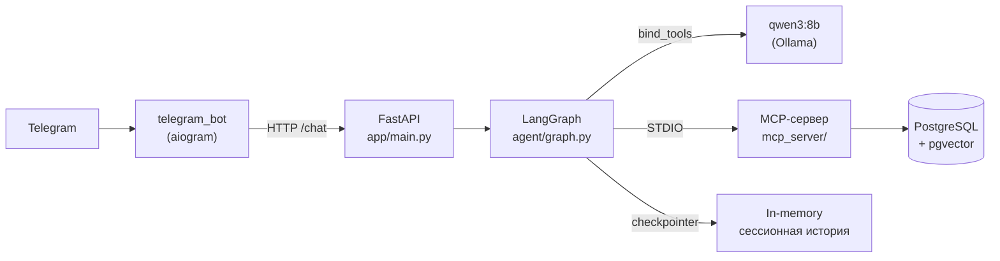

# Архитектура

## Обзор



Три независимых процесса:

- **FastAPI-сервис** (`app/`) — агент живёт здесь, отдаёт HTTP `/chat`.
- **MCP-сервер** (`mcp_server/`) — отдельный процесс, порождается FastAPI-сервисом
  как подпроцесс по STDIO (так же, как Claude Desktop/Code запускают локальные
  MCP-серверы). Не переиспользован готовый сервер — вакансия, под которую
  делался проект, явно проверяла умение самому спроектировать инструменты.
- **Telegram-бот** (`telegram_bot/`) — обычный HTTP-клиент `/chat`, ничего не
  знает про LangGraph, MCP или БД напрямую.

`shared/` — код, общий для `app/` и `mcp_server/` (модели SQLAlchemy, engine,
конфиг подключения к БД) — оба процесса читают одну и ту же базу.

## Агент: граф, а не цепочка

`agent/graph.py` собирает `StateGraph` вручную (не через `create_react_agent`,
который в актуальной версии LangGraph вообще deprecated в пользу
`langchain.agents.create_agent`):

```
agent_node --(есть tool_calls?)--> tools_node --> agent_node --(нет)--> END
```

`agent_node` — единственная нода, которая реально обращается к LLM;
`ToolNode` выполняет уже принятое решение. Цикл возможен именно потому, что
это граф с условным ребром, а не линейная цепочка вызовов.

Системный промпт (`agent/my_prompts.py`) построен на конкретных примерах
формулировок, а не общих описаниях: `qwen3:8b` надёжно обобщает поведение по
показанным примерам ("если пользователь пишет как в примере X — вызови
тул Y"), но не всегда обобщает абстрактные инструкции вроде "сохраняй важные
факты" без образца, что это такое.

## Две памяти, разные механизмы

- **Временная (сессионная)** — история диалога в `state["messages"]`,
  персистится LangGraph checkpointer'ом по `thread_id`. Сейчас `MemorySaver`
  (в оперативной памяти процесса, не переживает рестарт — сознательный
  компромисс для пет-проекта, см. `docs/ROADMAP.md`).
- **Постоянная** — отдельные факты о пользователе и база знаний документов,
  через собственные MCP-тулы поверх PostgreSQL/pgvector. Не зависит от
  `thread_id` — видна в любой новой сессии, переживает `/reset` в боте.

Разделение осознанное: checkpointer решает задачу "не потерять нить
разговора", MCP-память — задачу "запомнить факт навсегда и найти его по
смыслу". Это разные механизмы, а не один, потому что решают разные задачи.

## MCP-сервер: 5 тулов

| Тул | Назначение |
|---|---|
| `save_memory` | сохранить факт о пользователе |
| `recall_memory` | найти ранее сохранённый факт (векторный поиск) |
| `ingest_document` | распарсить PDF/`.docx`, разбить на чанки, сохранить в базу знаний |
| `search_documents` | найти конкретный факт в уже загруженных документах |
| `analyze_document` | целиком проанализировать документ / сделать сводку |

### Двухуровневый поиск документов

Векторный поиск по содержимому чанков (`DocumentChunk.embedding`) хорош для
точечных фактов, но плохо отвечает на вопрос "какой из моих документов имеет
в виду пользователь". Для этого у `Document` есть отдельный
`description`/`description_embedding` — короткое описание документа,
которое сама LLM генерирует при `ingest_document`, специально
сформулированное с учётом синонимов типа документа (например,
"Резюме (CV) ..."), чтобы меньше зависеть от многозначности отдельных слов.

### Модель никогда не видит служебные данные

`file_path`, `file_id`, `mime_type`, `user_id`, `thread_id` — не параметры,
которые заполняет LLM. Они:

1. скрыты из JSON-схемы тула, которую видит модель (`hide_sensitive_args` в
   `app/mcp_client/client.py`);
2. подставляются интерцептором (`inject_user_context`) прямо в вызов тула на
   пути к MCP-серверу, из доверенного `AgentContext`, а не из текста диалога.

Это не просто гигиена — это фикс реального бага: путь к файлу, переданный
текстом в истории диалога, терялся при обрезке контекста (`trim_messages`) и
модель начинала галлюцинировать правдоподобные, но неверные пути.

## Стек данных

- SQLAlchemy 2.0 (async), драйвер **`asyncpg`** — не `psycopg`: на Windows
  async-режим `psycopg3` требует `SelectorEventLoop`, который не поддерживает
  asyncio-подпроцессы, а MCP-клиенту нужно спавнить подпроцесс. `asyncpg`
  работает на дефолтном `ProactorEventLoop` без этого конфликта.
- Alembic-миграции, не `Base.metadata.create_all()` — история схемы
  версионируется и накатывается инкрементально.
- Эмбеддинги — `nomic-embed-text` через Ollama (та же локальная инфраструктура,
  что и основная модель).

## Тестирование

`tests/test_agent_tools.py` — интеграционные тесты без моков: поднимают
реальный граф агента и гоняют его через живую Ollama, Postgres и
MCP-подпроцесс. Осознанный выбор: для локальной модели важно проверять не
только "код не падает", но и "модель реально вызывает нужный тул с нужными
аргументами" — это и есть основной риск при выборе self-hosted LLM для tool
calling, и мокирование его бы не поймало.
